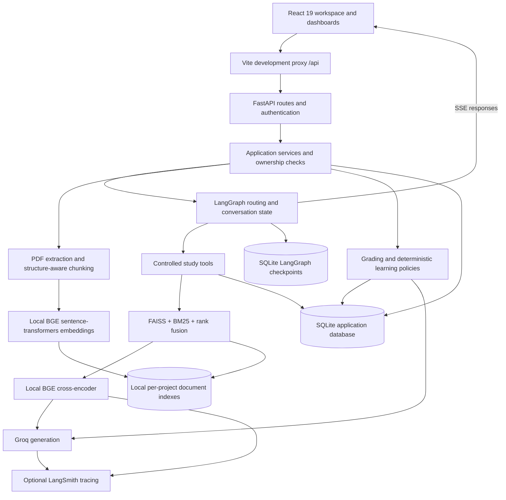

# Architecture

## References and scope

The requirements reference is [Project_Requirements.pdf](Project_Requirements.pdf), PRD v3.0, especially sections 3–18 and 20. The implementation brief is [antigravity_prompt_compact.md](antigravity_prompt_compact.md): extend StudyMate rather than rewrite it, prioritizing isolation, grounding, and the learning loop.

The PRD takes precedence over the brief's unfilled `[PRD]` placeholder. Requirements describe the intended product; the implementation details and limitations below describe the inspected repository, not a claim that every PRD workflow is fully wired.

The RAG/agent foundation comes from a prior team project, **StudyMate**. This submission substantially extends that foundation; see [AI_USAGE.md](AI_USAGE.md).

## System diagram



The diagram shows component relationships, not a claim that every assessment or background-learning capability is reachable through the current browser flow. Ingestion currently executes inline; it is not a distributed worker service.

## Component responsibilities

| Layer | Implementation | Responsibility |
|---|---|---|
| Frontend | `frontend/src/`, React, Vite, Tailwind, Framer Motion | Authentication UI, active workspace, materials, chat, study tools, dashboard/analytics surfaces |
| API | `backend/app/api/`, `backend/app/auth/` | Request validation, authenticated identity, owned-resource checks, admin-only dependencies |
| Application | `backend/app/services/` | Chat/document orchestration, citation handling, grading, mastery and learning policy |
| Agent | `backend/app/agent/` | Intent routing, controlled tool execution, synthesis and checkpointed conversation |
| Tools | `backend/app/tools/` | RAG, quiz, flashcard, planner, progress and read-only recommendation interfaces |
| Knowledge | `backend/app/rag/` | PDF extraction/chunking, local embeddings, FAISS/BM25 retrieval, fusion and reranking |
| Persistence | `backend/app/db/` | ORM entities, CRUD, ownership relationships, events, usage and job records |
| Evaluation | `backend/tests/`, `backend/eval/` | Backend checks and separately recorded model/retrieval evaluations |

`backend/app/main.py` composes the application in its lifespan: initialize tables and checkpoints, load embeddings, construct Groq clients, create tools and services, and close the checkpoint connection at shutdown.

## Data model and ownership

The conceptual hierarchy follows the PRD:

```text
User
  Space
    Project (represented by the existing Thread entity / threads table)
      Documents/materials and local retrieval indexes
      Conversation messages and checkpointed state
      Concepts
      Assessment evidence and concept mastery
      Recommendations and learning events
      Ingestion jobs, AI usage and retrieval traces
```

Keeping `Thread` as the project representation preserves existing study-tool and conversation integration. Consequently, `thread_id` and `project_id` can refer to the same project identity across older and newer interfaces; they are not separate tenants.

Protected API routes obtain identity through authentication dependencies, then scope queries to the current user. Document operations check ownership of the parent project. Analytics distinguishes user-scoped home/global views, owned-project views, and admin-only aggregate routes. The frontend's selected project is context, not an authorization boundary.

Retrieval uses project/document namespaces and must resolve only indexes associated with the authorized project. Model-facing tools rely on server-supplied execution context; IDs generated by the model must never establish ownership. Isolation regression tests include `backend/tests/test_vectorstore_isolation.py` and authentication coverage in `backend/tests/test_auth.py`. This is not a claim of an exhaustive security audit.

## Material and tutor flow

1. An authenticated user uploads a PDF to an owned project.
2. The document service extracts text and creates chunks with source/page metadata. Structure-aware handling reduces splitting of table-like text; scanned-page OCR is not implemented.
3. Local `BAAI/bge-small-en-v1.5` embeddings produce FAISS representations. BM25 supplies complementary lexical retrieval.
4. Retrieval combines candidate results and reranks them using local `BAAI/bge-reranker-base` by default.
5. The grounding policy uses a `0.35` relevance cutoff. This is a heuristic tied to the scoring pipeline, not a calibrated probability of correctness.
6. The tutor receives project evidence and relevant conversation context. The grounded path must explain insufficient evidence instead of inventing an answer.
7. Citation handling maps model-selected evidence markers back to retrieved source documents/pages. Empty or unrecognized citations must not be interpreted as verified support.
8. The chat service returns streamed responses and persists conversation state.

The agent has both grounded-document and general-chat behavior. The standalone `RagQueryService` used by P4 evaluation is a direct retrieval-and-generation path, not the entire authenticated chat/UI workflow. Its result cannot establish all agent-routing, isolation, or learning-loop properties.

## Learning policies and controlled AI interaction

The PRD calls for MCQ and open-ended assessment, mastery updates, growth analysis and next actions. The repository retains the original MCQ study flow and adds:

- `grading.py` and `OpenEndedGrade`: evidence-based grading with validated understanding/accuracy scores, covered/missing concepts and feedback.
- `mastery.py`: deterministic, bounded EMA updates and event-key deduplication.
- `learning.py`: concept resolution, adaptive concept/difficulty selection, growth classification and repeated-mistake detection.
- `recommendation_tool.py`: a read-only model-facing recommendation query based on persisted evidence.

The grade score is the equal-weight mean of understanding and accuracy. Mastery is `0.85 × previous + 0.15 × evidence`, initialized at 50. Detailed thresholds and rationale are in [ASSUMPTIONS.md](ASSUMPTIONS.md).

**Control boundary:** deterministic state mutations remain internal application operations; the recommendation tool is read-only. The compact brief requested new mutations through the ToolNode pattern, but the inspected learning helpers are not themselves exposed as model-facing mutation tools. This is a documented implementation difference, not an invented tool integration. Service tests alone do not demonstrate a fully connected open-ended assessment UI or end-to-end mastery update workflow.

## Events, ingestion jobs and analytics

Application events and AI-call records are separate:

- **Events:** project/material/tutor/learning activity, with unique event keys to avoid duplicate records on retry.
- **AI-call log:** model, feature, latency, success and available usage fields.
- **Retrieval traces:** selected chunks, retrieval strategy, threshold and grounding details.
- **Ingestion jobs:** ownership, status, retry count and errors.
- **LangSmith:** optional external tracing for deeper AI diagnostics.

The persisted job vocabulary is `queued`, `processing`, `ready`, `failed`. However, the inspected upload route calls ingestion synchronously, then records a ready job after success. Retrying a failed job updates it to queued; that alone is not a durable worker or actual reprocessing guarantee.

Home/project/global analytics are separate learner surfaces. Admin operations/product routes provide aggregate usage, activity and job information. Their existence does not establish all PRD admin filters, individual learning-journey inspection, or infrastructure monitoring.

## Persistence and deployment decisions

- SQLAlchemy uses **SQLite with WAL and foreign keys**, not Postgres.
- Application state defaults to `backend/chatbot.db`.
- LangGraph state is stored separately in `backend/langgraph_checkpoints.db`.
- FAISS indexes and model caches are local disk assets; they require persistent writable storage.
- Schema initialization includes lightweight SQLite compatibility changes, not a full migration framework.
- The development frontend proxies `/api` to port 8000. A production deployment needs its own API routing and persistent-storage configuration.
- The reported Node-version blocker prevents a verified production frontend build; deployment and video evidence were not checked in this documentation-only phase.

## Requirement alignment and evidence limits

| PRD area | Repository evidence | Boundary |
|---|---|---|
| Spaces/projects and isolation (§3–4, §15) | Auth, owned-resource routes, namespace tests | Tests are not a complete authorization audit |
| Materials and grounding (§5–7) | PDF RAG, citations, refusal policy | No OCR; ingestion is inline |
| Controlled application interaction (§8) | Tool wrappers and Pydantic contracts | New state-changing learning helpers remain internal |
| Assessment/mastery/growth (§9–11) | Grading/mastery/learning services and tests | Complete browser-loop integration is not established by these helpers |
| Events/analytics/background work (§12–16) | Events, jobs, usage/traces, dashboards | No durable queue; telemetry and admin depth remain prototype-level |
| Testing/evaluation (§14, §18) | Owner-reported 193/193 tests; saved live evaluation 6/8 | Separate measurements; neither was rerun for P5 |
| Submission (§20) | This documentation set and local setup instructions | Public deployment, demo video and fresh-clone execution not verified here |

See [KNOWN_LIMITATIONS.md](KNOWN_LIMITATIONS.md) for operational consequences and [EVAL_WRITEUP.md](EVAL_WRITEUP.md) for the actual saved evaluation results.