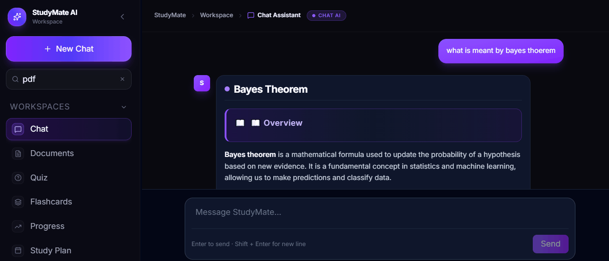
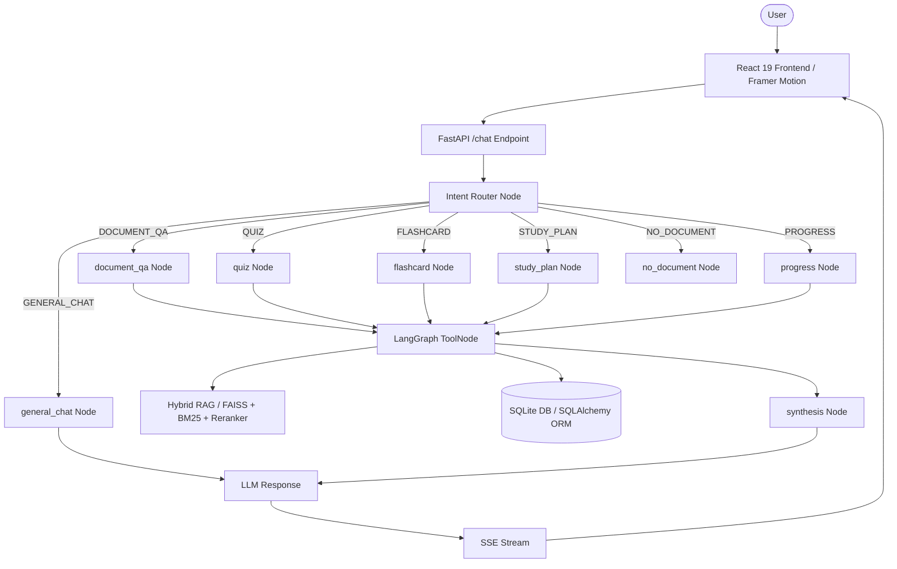

# StudyMate — Contextual AI Study Workspace

StudyMate is a modern, high-performance AI study workspace that transforms course material PDFs into an interactive, document-grounded learning environment. Built to feel like a premium AI application (Linear, Notion, Perplexity UI quality), it enables students to ask grounded questions with page-level citations, generate multiple-choice quizzes, study 3D flip flashcards, schedule exam prep plans, and track study progress over time.

The application is built using **FastAPI**, **LangGraph**, **React 19**, **Vite**, **Framer Motion**, and a hybrid RAG pipeline (**FAISS + BM25 + Cross-Encoder reranking**).

---

## 🎬 Project Preview



---

## 🌟 Key Features

### 🎨 Premium Design System & UI/UX (Linear / Perplexity Quality)
- **Deep Dark Theme (`#09090F`)**: Floating glassmorphism surfaces, soft violet (`#8B5CF6`) & blue accent gradients, dynamic animations.
- **Framer Motion Animations**: Smooth workspace tab switching, floating question cards, quiz option check & shake animations.
- **Minimal TopBar Header**: Sticky breadcrumb bar displaying active tool status and thread context.

### 📚 Contextual Workspace Modules

#### 1. 🎴 Flashcards Workspace
- **Fixed-Width 3D Card Flip**: 3D rotation flip with solid face colors (`#12121c`) and anti-aliased font rendering (100% crisp text, no subpixel blur).
- **Gamified Study Metrics**: Circular SVG progress ring, XP counter, study streak tracker, and 3 recall buttons (*Got It*, *Learning*, *Review Later*).
- **Celebration Blast**: Custom canvas-confetti animation trigger upon deck completion.

#### 2. 📝 Quiz Workspace
- **Document-Grounded Questions**: Generates 4-option MCQs with real RAG source citations (`[Filename, Page X]`).
- **Interactive Option Feedback**: Instant green check animation for correct options and red shake animation (`x: [-10, 10, -8, 8, 0]`) for wrong options.
- **Expanding Explanations**: Collapsible detailed rationale displaying exact source PDF evidence.

#### 3. 🎯 "Quiz Me on This" Contextual Workflow (Single-Click Execution)
- **One-Click Execution**: Clicking *"Quiz Me on This"* on any weak topic in Study Progress automatically opens the Quiz workspace, pre-fills the topic, auto-selects the source PDF, and presents the weak topic banner.
- **Multi-PDF & Resilience**: Handles multi-PDF threads with source selectors and provides graceful fallbacks for deleted documents.

#### 4. 📅 Study Plan Workspace
- **Day-by-Day Schedules**: Generates multi-day revision timelines grounded in PDF topics.
- **Task Checklist & Track**: Interactive task checkboxes with a dynamic percentage progress track and topic action shortcuts (*Practice Quiz →*, *Study Flashcards →*).

#### 5. 📈 Study Progress Workspace
- **Structured Performance Tracking**: Displays accuracy percentages, attempted quizzes, and automatically identified weak topics across sessions.

### 🧠 Backend AI & Architecture
- **Deterministic Intent Routing**: Pure-Python regex classification that routes queries before LLM tool binding to prevent model function-calling failures. Supports general conversational chat and general-knowledge discussion queries.
- **Hybrid RAG Pipeline**: Combines FAISS dense vector search, BM25 lexical keyword matching, and Cross-Encoder reranking (`ms-marco-MiniLM-L-6-v2`).
- **Single Source of Truth Context**: State management via `WorkspaceContext.jsx` for zero data-loss transitions.
- **Streaming Responses**: Real-time message streaming over Server-Sent Events (SSE).

---

## 🏗️ Architecture



---

## 🛠️ Tech Stack

| Layer | Technologies |
|---|---|
| **Frontend** | React 19, Vite, Tailwind CSS, Framer Motion, Canvas-Confetti, Lucide Icons |
| **Backend** | Python 3.12, FastAPI, Uvicorn, Pydantic v2 |
| **AI & Orchestration** | LangGraph, LangChain Core, Groq API (`llama-3.3-70b-versatile`) |
| **RAG Pipeline** | FAISS, BM25 (`langchain_community`), Cross-Encoder (`ms-marco-MiniLM-L-6-v2`) |
| **Database** | SQLite (WAL Mode) via SQLAlchemy 2.0 ORM |
| **Streaming** | Server-Sent Events (SSE) via `StreamingResponse` |
| **Testing** | Pytest (166 unit & integration tests) |

---

## 📂 Project Structure

```text
StudyMate/
├── backend/
│   ├── app/
│   │   ├── agent/       # LangGraph state machine, nodes, and intent router
│   │   ├── api/         # FastAPI router endpoints and dependencies
│   │   ├── db/          # SQLAlchemy ORM models, session setup, and CRUD operations
│   │   ├── rag/         # Document ingestion, FAISS/BM25 retrieval, and reranking
│   │   ├── schemas/     # Pydantic request and response schemas
│   │   ├── services/    # Business logic services for chat, threads, and documents
│   │   ├── tools/       # LangChain tools for RAG, memory, quiz, flashcards, and plans
│   │   └── main.py      # FastAPI application entrypoint and lifespan context
│   └── tests/           # Pytest unit and regression test suite (166 tests)
├── frontend/
│   ├── src/
│   │   ├── api/         # REST API fetch helpers
│   │   ├── components/  # Floating sidebar, TopBar, and workspace router
│   │   │   └── workspace/ # Flashcards, Quiz, Planner, and Progress workspace components
│   │   ├── context/     # WorkspaceContext single source of truth state
│   │   ├── lib/         # SSE stream reader and API consumers
│   │   └── App.jsx      # Root application shell
│   └── vite.config.js   # Vite dev server and proxy configuration
├── PROJECT_ARCHITECTURE.md   # Full technical specification document
└── STUDYMATE_PROJECT_OVERVIEW.md # Comprehensive academic project overview
```

---

## 🚀 Getting Started

### Prerequisites
- Python 3.12+
- Node.js 18+

### Backend Setup

```bash
cd backend
python -m venv .venv

# Windows
.venv\Scripts\activate
# macOS/Linux: source .venv/bin/activate

pip install -r requirements.txt
uvicorn app.main:app --reload
```

### Frontend Setup

```bash
cd frontend
npm install
npm run dev
```

### Environment Variables

Create a `.env` file in the `backend/` directory:

```env
GROQ_API_KEY=gsk_...
GROQ_QUIZ_API_KEY=gsk_...
GROQ_MODEL=llama-3.3-70b-versatile
DATABASE_URL=sqlite:///backend/chatbot.db
```

---

## 🧪 Testing

StudyMate includes an automated Pytest regression test suite covering intent routing, hybrid retrieval, memory persistence, and tool execution.

To run the backend test suite:

```bash
cd backend
.venv\Scripts\python.exe -m pytest tests/ -v
```

**Result**: 166 passed (100% success rate).

To verify the frontend build:

```bash
cd frontend
npm run build
```

---

## 📜 License

This project is licensed under the [MIT License](LICENSE).

---

## 👨‍💻 Author

- **GitHub**: [Gayathri-b-06](https://github.com/Gayathri-b-06)
